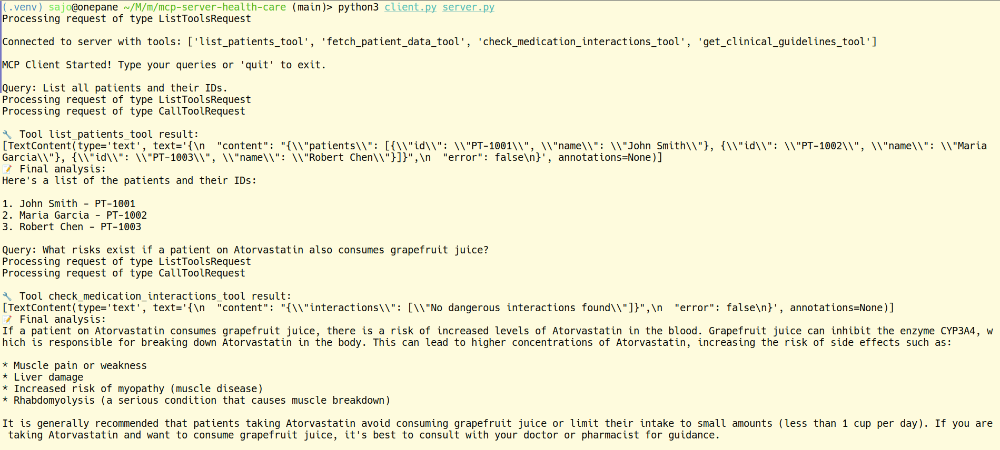

# MCP Healthcare Server & Client

A simple microservice platform for healthcare data using MCP (Microservice Control Protocol). Quickly build and deploy tools for EHR lookups, medication interaction checks, and clinical guideline retrieval.

## Features

* **List Patients**: Fetch patient IDs and names
* **Patient Data**: Retrieve full EHR records (labs & medications)
* **Medication Interactions**: Check for dangerous drug interactions
* **Clinical Guidelines**: Get treatment protocols for common conditions


## Sample Screnshorts




## Installation

1. Clone the repo:

   ```bash
   git clone https://github.com/sajosam/mcp-server-client.git
   cd mcp-server-health-care
   ```
2. Create & activate a virtual environment:

   ```bash
   python3 -m venv .venv
   source .venv/bin/activate
   ```
3. Install dependencies:

   ```bash
   pip install -r requirements.txt
   ```
4. Set your environment variables in `.env` (e.g., `GROQ_API_KEY`).

## Usage

* **Start the Server**:

  ```bash
  python3 server.py
  ```
* **Run the Client**:

  ```bash
  python3 client.py server.py
  ```
* In the client, type queries like:

  * `list all patients`
  * `fetch patient data for PT-1001`
  * `check medication interactions for [\"Aspirin\", \"Lisinopril\"]`
  * `get clinical guidelines for diabetes`


MCP server healthcare, MCP client, healthcare microservices, medical API, EHR integration, clinical guidelines, medication interactions
